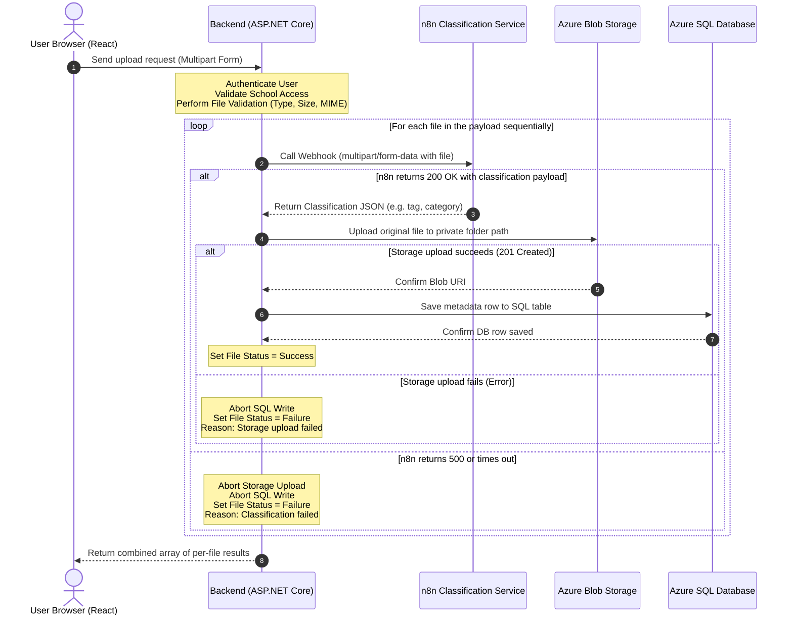

# DATA_FLOW.md - System Data Flow & Lifecycle

This document describes the workflow sequence, pipeline steps, and operational boundaries of the file uploading and storage execution path in the **الأرشيف المدرسي العربي** (Arabic School Archive) system.

---

## 1. Sequence Flow Diagram

---

## 2. Text Flow Sequence (Step-by-Step)

For each file in the upload payload, the application follows this exact sequence:

1. **Validate**: Perform local file validations (extension checks, size checks, and magic bytes MIME verification).
2. **Call n8n**: Call the n8n classification webhook passing the file payload.
3. **Blob Storage Upload**: If the n8n call succeeds, upload the original file to private Azure Blob Storage.
4. **Save DB Row**: If the Blob Storage upload succeeds, save the file's metadata row to the Azure SQL Database.
5. **Fail-Fast Boundary**: If any step in this sequence fails (validation fails, n8n fails/times out, or Blob Storage fails), the process is aborted immediately, and the system **does not save a DB row**. 

**DB write is always last.** Under no circumstances will a database record be generated prior to completing all validation, classification, and physical file storage steps.

---

## 3. Request vs. Response Behaviors

- **Single-File Upload**:
  - Behaves as a single iteration of the sequential loop.
  - Returns a standard success or failure response corresponding to the file's final status.
- **Multi-File Upload**:
  - The client uploads multiple files in a single array.
  - The backend handles isolation between files; if File 1 fails n8n classification but File 2 succeeds, the backend completes the lifecycle for File 2 and saves it, while returning a detailed error message for File 1.
  - Returns a unified array response mapping each file's original name to its operational status.
