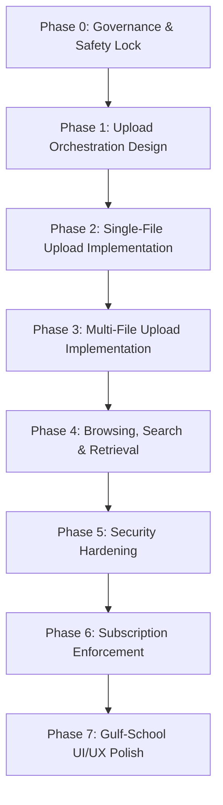

# ROADMAP.md - Phased Development Roadmap

This document outlines the phased implementation roadmap for the **الأرشيف المدرسي العربي** (Arabic School Archive) project. Each phase has strict gates, allowed activities, and prohibited work to ensure maximum quality and isolation stability.

---

## Roadmap Overview

---

## Phase Details

### Phase 0: Inspection, Governance & Safety Lock (APPROVED 2026-06-16)
- **Goal**: Establish project architecture, tenancy boundaries, security assumptions, local execution guidelines, and agent governance documents.
- **Allowed Work**:
  - Codebase inspection and setting up folders.
  - Creating and refining all 15 core governance documentation files under `docs/agent/`.
- **Prohibited Work**:
  - Writing code implementation (controllers, entities, repositories, database migration scripts).
  - Writing code templates or scaffolding database schemas.
- **Exit Criteria**:
  - All 15 documentation files created, validated, and signed off by the user. **MET.**
- **Dependencies**: None.
- **Risks**: Architectural misalignment before writing code.
- **Sign-off**: User approved Phase 0 completion. Phase 1 is now active.

---

### Phase 1: Upload Orchestration Design (ACTIVE PHASE)
- **Goal**: Formulate the design specification for upload orchestration, multi-file execution flow, database row contract, blob path convention, school isolation rules, and failure boundaries.
- **Allowed Work**:
  - Writing conceptual API specifications, sequence flow schemas, database row entity diagrams, and JSON payload contracts.
  - Formulating exact rules for sequential n8n and Blob storage transfers.
  - Producing design documents under `docs/agent/`: `UPLOAD_CONTRACT.md`, `DB_SCHEMA_PLAN.md`, `API_CONTRACTS.md`, `STORAGE_CONTRACT.md`, `FAILURE_HANDLING.md`, plus updates to `ROADMAP.md`, `PROGRESS.md`, and `DECISIONS.md`.
- **Prohibited Work**:
  - Writing functional controllers, repository handlers, active validation code, or live API endpoints.
  - Creating DB migrations, scaffolding models, or provisioning local/cloud infrastructure.
  - Writing any UI code, React components, or visual layout work.
- **Exit Criteria**:
  - Detailed architecture review and approval of the design documents, DB row contracts, upload sequence flows, storage path conventions, and per-file response contract. All produced under `docs/agent/` only.
- **Dependencies**: Phase 0 signed off (met).
- **Risks**: Divergence between the approved schema contracts and actual implementation structures in later phases.

---

### Phase 2: Single-File Upload Implementation (PENDING - LOCKED)
- **Goal**: Implement the secure single-file upload sequence: validate file metadata, forward to n8n webhook, upload to private Azure Blob container, and persist record to Azure SQL DB metadata storage.
- **Allowed Work**:
  - Creating single-file controller endpoints, validation middleware, and n8n proxy services.
  - Setting up EF Core models and Blob Storage integration services.
  - Writing integration/unit tests for single file successes and failures.
- **Prohibited Work**:
  - Multi-file collection loops, batch uploads, or subscription lock enforcement logic.
- **Gate Constraint**: Phase 1 design documents must be approved before Phase 2 implementation begins.
- **Exit Criteria**:
  - Fully tested single-file upload flow successfully executes (validates -> n8n -> Blob -> DB metadata, with DB written last).
- **Dependencies**: Phase 1 approval.
- **Risks**: Network latencies calling n8n webhook synchronously.

---

### Phase 3: Multi-File Upload & Partial Success Implementation
- **Goal**: Orchestrate multi-file uploading inside the application layer. Loop files sequentially, making separate n8n calls per file, and outputting granular success/failure states for each file in the response.
- **Allowed Work**:
  - Designing and implementing the multi-file application loop.
  - Creating response serializer formatting filename, status, and error messages.
  - Building basic React upload page with success/error states mapped by filename.
- **Prohibited Work**:
  - Advanced search features, subscription billing logic, or advanced file download permissions.
- **Exit Criteria**:
  - Uploading three files with mixed validations results in clear granular responses (e.g., File A: Success, File B: Refused Type, File C: DB Write Error).
- **Dependencies**: Phase 2 completed.
- **Risks**: Heavy memory footprint from loading multiple concurrent files.

---

### Phase 4: Archive Browsing, Search & Retrieval
- **Goal**: Allow school staff to safely browse metadata in SQL DB and retrieve/download files securely via short-lived SAS (Shared Access Signature) tokens.
- **Allowed Work**:
  - Building Search and Retrieve APIs with strict tenancy query filters (`WHERE school_id = X`).
  - Implementing an Azure Blob SAS generation utility (valid for 5-15 mins maximum).
  - Building React UI components to list, search, and download archived records.
- **Prohibited Work**:
  - Bulk file modifications or administrative subscription status changes.
- **Exit Criteria**:
  - Staff can only view and download files belonging to their authenticated `school_id`. Attempting to access another school's document ID returns a `403 Forbidden` response.
- **Dependencies**: Phase 3 completed.
- **Risks**: SQL injection or tenant leak if query parameter authorization is bypassed.

---

### Phase 5: Security Hardening
- **Goal**: Fortify the system using magic bytes inspection, strict MIME verification, rate-limit restrictions, audit trail logging, and secret encryption.
- **Allowed Work**:
  - Developing binary signature validation (checking file magic bytes instead of just file extensions).
  - Implementing Rate Limiting middleware and Audit log tables.
  - Hardening CORS configurations and Azure Blob container network policies.
- **Prohibited Work**:
  - Business features outside the security checklist.
- **Exit Criteria**:
  - Security audit and regression test suites executed and passing successfully.
- **Dependencies**: Phase 4 completed.
- **Risks**: Slower upload processing times due to file content binary inspections.

---

### Phase 6: Subscription Enforcement
- **Goal**: Implement annual subscription checks server-side for school access locks.
- **Allowed Work**:
  - Developing server-side subscription check middlewares.
  - Implementing tenant state caches (Active, Expired, Suspended, Grace Period).
  - Building React Renew-Required dashboard placeholders.
- **Prohibited Work**:
  - Integrated payment gateway checkouts (manual/admin renewal triggers only).
- **Exit Criteria**:
  - When subscription status is "Expired" (past grace period), all upload, search, and retrieval APIs return `402 Payment Required` or `403 Forbidden`.
- **Dependencies**: Phase 5 completed.
- **Risks**: Clock synchronization errors or caching discrepancies causing valid subscriptions to be falsely blocked.

---

### Phase 7: Gulf-School UI/UX Polish
- **Goal**: Deliver a culturally appropriate, RTL-first, clean Arabic layout suited for academic administration offices in Gulf schools.
- **Allowed Work**:
  - Adjusting CSS styles, fonts, layout, and RTL flow.
  - Adding micro-animations and smooth state transition helpers.
  - Localizing all application layers into high-quality educational Arabic.
- **Prohibited Work**:
  - Structural modifications to backend business logic or security architectures.
- **Exit Criteria**:
  - Interface matches the approved UI guidance, is completely RTL, responsive, and achieves high visual polish scores.
- **Dependencies**: Phase 6 completed.
- **Risks**: Inconsistent rendering on older browsers used in school administrations.
