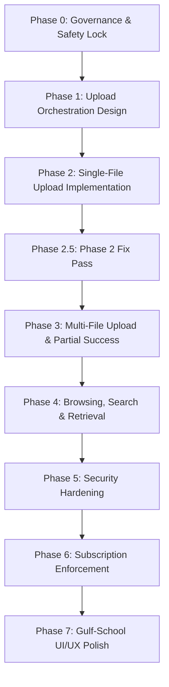

# ROADMAP.md - Phased Development Roadmap

This document outlines the phased implementation roadmap for the **الأرشيف المدرسي العربي** (Arabic School Archive) project. Each phase has strict gates, allowed activities, and prohibited work to ensure maximum quality and isolation stability.

---

## Roadmap Overview

---

## Phase Details

### Phase 0: Inspection, Governance & Safety Lock (APPROVED)
- **Goal**: Establish project architecture, tenancy boundaries, security assumptions, local execution guidelines, and agent governance documents.
- **Allowed Work**:
  - Codebase inspection and setting up folders.
  - Creating and refining all 15 core governance documentation files under `docs/agent/`.
- **Prohibited Work**:
  - Writing code implementation (controllers, entities, repositories, database migration scripts).
  - Writing code templates or scaffolding database schemas.
- **Exit Criteria**:
  - All 15 documentation files created, validated, and signed off by the user. **MET.**
- **Dependencies**: None.
- **Risks**: Architectural misalignment before writing code.
- **Sign-off**: User approved Phase 0 completion. Phase 1 is now active.

---

### Phase 1: Upload Orchestration Design (APPROVED 2026-06-16)
- **Goal**: Formulate the design specification for upload orchestration, multi-file execution flow, database row contract, blob path convention, school isolation rules, and failure boundaries.
- **Allowed Work**:
  - Writing conceptual API specifications, sequence flow schemas, database row entity diagrams, and JSON payload contracts.
  - Formulating exact rules for sequential n8n and Blob storage transfers.
  - Producing design documents under `docs/agent/`: `UPLOAD_CONTRACT.md`, `DB_SCHEMA_PLAN.md`, `API_CONTRACTS.md`, `STORAGE_CONTRACT.md`, `FAILURE_HANDLING.md`, plus updates to `ROADMAP.md`, `PROGRESS.md`, and `DECISIONS.md`.
- **Prohibited Work**:
  - Writing functional controllers, repository handlers, active validation code, or live API endpoints.
  - Creating DB migrations, scaffolding models, or provisioning local/cloud infrastructure.
  - Writing any UI code, React components, or visual layout work.
- **Exit Criteria**:
  - Detailed architecture review and approval of the design documents, DB row contracts, upload sequence flows, storage path conventions, and per-file response contract. All produced under `docs/agent/` only.
- **Dependencies**: Phase 0 signed off (met).
- **Risks**: Divergence between the approved schema contracts and actual implementation structures in later phases.

---

### Phase 2: Single-File Upload Implementation (APPROVED 2026-06-16)
- **Goal**: Implement the secure single-file upload sequence: validate file metadata, forward to n8n webhook, upload to private Azure Blob container, and persist record to Azure SQL DB metadata storage.
- **Status**: APPROVED. 23/23 xUnit tests green.
- **Allowed Work**:
  - Creating single-file controller endpoints, validation middleware, and n8n proxy services.
  - Setting up EF Core models and Blob Storage integration services.
  - Writing integration/unit tests for single file successes and failures.
- **Prohibited Work**:
  - Multi-file collection loops, batch uploads, or subscription lock enforcement logic.
- **Gate Constraint**: Phase 1 design documents must be approved before Phase 2 implementation begins. **MET.**
- **Exit Criteria**:
  - Fully tested single-file upload flow successfully executes (validates -> n8n -> Blob -> DB metadata, with DB written last). **MET.**
- **Dependencies**: Phase 1 approval. **MET.**
- **Risks**: Network latencies calling n8n webhook synchronously. **Monitored.**

---

### Phase 2.5: Phase 2 Fix Pass (COMPLETE 2026-06-16)
- **Goal**: Resolve the open items flagged after Phase 2 implementation: (1) wire a runnable JwtBearer auth scheme, (2) align `STORAGE_CONTRACT.md` allowlist wording with the implemented safe-name sanitizer (preserve Arabic Unicode), (3) document the two-mode DB behavior and the no-migrations state in `LOCAL_RUN.md`.
- **Status**: COMPLETE. 23/23 xUnit tests still green.
- **Allowed Work**:
  - Adding `Microsoft.AspNetCore.Authentication.JwtBearer` wiring and a `Configuration/AuthOptions.cs` class bound to a new `Auth` section in `appsettings.json`.
  - Updating the spec text in `STORAGE_CONTRACT.md` §2.2 to include the Arabic Unicode block.
  - Rewriting `LOCAL_RUN.md` with the configuration surface, two-mode DB behavior, manual `Archives` DDL, Azurite/n8n notes, and a smoke-test curl.
  - Updating `PROGRESS.md` and `TESTING.md` to reflect the fix pass and the migration state.
- **Prohibited Work**:
  - No new endpoints, no new services, no schema changes, no migration generation.
- **Exit Criteria**:
  - Build succeeds, xUnit suite green, controller `[Authorize]` is backed by a real JwtBearer scheme. **MET.**
- **Dependencies**: Phase 2 approval. **MET.**
- **Risks**: None significant. The spec drift is closed; remaining open item is the no-migrations state, which Phase 3+ will address.

---

### Phase 3: Multi-File Upload & Partial Success (APPROVED 2026-06-17)
- **Goal**: Orchestrate multi-file uploading inside the application layer. Loop files sequentially, making separate n8n calls per file, and outputting granular success/failure states for each file in the response. Keep the single-file endpoint backward compatible.
- **Status**: ACTIVE.
- **Allowed Work**:
  - Adding a multi-file iteration loop in the upload orchestrator and controller that binds a `files` form field and processes one file at a time.
  - Returning a 200 OK multi-status envelope with one per-file result entry in submission order.
  - Enforcing `Upload:MaxBatchSizeBytes` at the batch level.
  - Adding xUnit tests covering all-success, mixed success + Rejected + Failed, sequential ordering, batch-size limit, empty `files` collection, and the single-file backward-compat endpoint.
  - Updating `PROGRESS.md`, `TESTING.md`, `MANUAL_QA.md`, and `REQUEST_COLLECTION.md` (and `LOCAL_RUN.md` only if commands changed).
- **Prohibited Work**:
  - Search, retrieval, download, SAS tokens.
  - Subscription enforcement middleware.
  - Magic-bytes MIME verification, rate limiting, audit log, malware scanning.
  - Auth, JWT, dev-bypass, Docker, health endpoint rewrites.
  - Concurrent (parallel) upload processing.
  - React / frontend architecture.
  - Any change to locked Phase 1 design decisions except by appending Phase 3 notes in `DECISIONS.md`.
- **Exit Criteria**:
  - All Phase 2 tests still green; Phase 3 tests pass; uploading a 3-file batch with mixed outcomes yields a 200 OK with three per-file results in input order; the single-file endpoint keeps working. **MET.**
- **Dependencies**: Phase 2.5 fix-pass complete. **MET.**
- **Risks**: Heavy memory footprint from loading many files. Mitigated by the per-file `MemoryStream` allocation pattern in the orchestrator (no concurrent streams).

---

### Phase 4: Archive Browsing, Search & Retrieval (APPROVED 2026-06-17)
- **Goal**: Allow school staff to safely browse metadata in SQL DB and retrieve/download files securely via short-lived SAS (Shared Access Signature) tokens. Every query and every download is scoped to the authenticated `school_id` server-side.
- **Status**: ACTIVE.
- **Allowed Work**:
  - Building **list**, **search**, and **get-by-id** metadata endpoints with strict tenancy query filters (`WHERE school_id = @currentSchoolId`).
  - Implementing a download/retrieval endpoint that returns a short-lived (5-15 min) SAS URL for the authenticated tenant's blob. For local dev a parity abstraction is permitted (e.g. a "local-dev download" route that proxies the blob stream), as long as the **same auth/tenant check** runs first.
  - Adding pagination (`page`, `pageSize`) and basic filters (`originalName` contains, `category` exact, `uploadedFrom`, `uploadedTo`, `processingYear`, `processingMonth`).
  - Adding xUnit tests for: list school isolation, search school isolation, get-by-id same school, get-by-id other school, download same school, download other school, pagination, empty result, plus regression of all 41 prior tests.
  - Updating `PROGRESS.md`, `TESTING.md`, `MANUAL_QA.md`, `REQUEST_COLLECTION.md` (and `LOCAL_RUN.md` only if config/run steps changed).
- **Prohibited Work**:
  - Subscription enforcement, payments, magic-bytes inspection, rate-limiting, audit logging (none of these are required for retrieval safety in Phase 4).
  - Rewriting upload orchestration or any Phase 2/2.5/3 surface.
  - Frontend architecture. The API contract is consumed from `curl` / Postman / Bruno; a React UI is deferred to Phase 7.
- **Gate Constraint**: Phase 3 must be approved. **MET (2026-06-17).**
- **Exit Criteria**:
  - All 41 prior tests remain green; Phase 4 tests pass.
  - `GET /api/v1/archive/archives` returns the authenticated school's metadata only.
  - `GET /api/v1/archive/archives/{documentId}` returns 200 for the same school, 404 for another school (no metadata leak).
  - `GET /api/v1/archive/archives/{documentId}/download` returns a short-lived signed URL (or the dev-equivalent) for the same school, and 404 for another school.
  - Pagination is honored (page/pageSize round-trip and `totalCount` reported).
  - Filters compose with the tenant filter without bypassing it.
- **Dependencies**: Phase 3 approval. **MET.**
- **Risks**: Tenant leak if the `school_id` filter is forgotten on a code path. Mitigated by a `IArchiveReadRepository` interface whose methods require `schoolId` and cannot be called without it; integration tests cover the cross-tenant negative case.

---

### Phase 5: Security Hardening (APPROVED 2026-06-17)
- **Goal**: Fortify the existing upload / browse / retrieval system without changing business scope. Add binary-signature validation, per-tenant rate limiting, audit logging, CORS allowlist, secret scrubbing, and re-confirm blob/SAS safety.
- **Status**: APPROVED. 83/83 xUnit tests green at the close of Phase 5.
- **Allowed Work**:
  - **Magic-bytes / binary signature validation** for the existing allowlist (PDF, DOCX, XLSX, PNG, JPG/JPEG). Validates that the file's first bytes match the declared extension and MIME type. Rejects with `Rejected/MAGIC_BYTES_MISMATCH`.
  - **Cross-check of extension, declared MIME, and magic bytes** — all three must agree; any disagreement is a `Rejected` outcome with a precise `reasonCode`.
  - **Rate limiting** middleware: per-tenant token-bucket for upload routes (lower cap, e.g. 30 req/min) and per-tenant token-bucket for read routes (higher cap, e.g. 300 req/min). Excess returns HTTP 429 `RATE_LIMITED`.
  - **Audit log** for: upload success, upload rejection, browse success, get-by-id success, get-by-id cross-tenant attempt (logged as `forbidden_tenant_access`), download (SAS-issued) success, runtime failures (n8n / blob / db). Audit entries go to a structured `ILogger` channel (`Audit`) and **never** include secrets, raw file content, the signed URL, or request bodies.
  - **CORS hardening**: explicit allowlist in `Cors:AllowedOrigins`. Wildcard origins are rejected at config-load time. Default is empty (no CORS), so a misconfigured prod deploy does not accidentally expose the API.
  - **Blob/SAS review**: keep `BlobSasPermissions.Read` only, keep the 5–15 min clamp, keep the tenant-prefix guard, refuse any `blobObjectName` containing `..` or a non-tenant prefix. No path traversal.
  - **Secret scrubbing**: a small `LogScrubber` helper used by the existing `appsettings.json` and the new audit logger, so `JwtBearer`-related headers, the `Blob:ConnectionString` AccountKey, and the `N8N:SharedSecret` are never written to logs.
  - **Dev-bypass stays dev-only**: the `DevBypassAuthHandler` re-check and the `MultiAuth` policy scheme are unchanged. No new code path may enable the bypass outside `ASPNETCORE_ENVIRONMENT=Development` **and** `Auth:DevBypassEnabled=true`.
  - **Backward compatibility**: every Phase 2/2.5/3/4 endpoint keeps its response shape. The new security rejections are returned as `Rejected` results in the existing envelope (upload) or HTTP error codes (rate limit / CORS).
  - **Tests**: 11 required test cases (per the user prompt) plus regression of all 58 prior tests. New tests live under `ArabicSchoolArchive.Tests/Services/`, `ArabicSchoolArchive.Tests/Middleware/`, and `ArabicSchoolArchive.Tests/Audit/`.
- **Prohibited Work**:
  - Subscription enforcement, payments, frontend, broad architecture changes.
  - Rewriting the upload orchestrator, the browse controller, or the SAS generator — only **adding** security checks is allowed; existing semantics must be preserved.
  - Logging secrets, tokens, SAS URLs, JWTs, or raw file contents. (Auditing must not be a leak vector.)
- **Gate Constraint**: Phase 4 must be approved. **MET (2026-06-17).**
- **Exit Criteria**:
  - All 58 prior tests remain green.
  - All 11 Phase 5 test cases pass.
  - A PDF with valid magic bytes, declared extension, and declared MIME is accepted; the same PDF with corrupted magic bytes is rejected with `MAGIC_BYTES_MISMATCH`.
  - The upload route returns 429 `RATE_LIMITED` after the configured per-tenant upload cap; the read route returns 429 `RATE_LIMITED` after the per-tenant read cap.
  - An audit record exists for: upload success, upload rejection, get-by-id cross-tenant attempt, and download.
  - CORS preflight from a non-allowlisted origin returns no `Access-Control-Allow-Origin` header.
  - `dotnet build` succeeds, `dotnet test` is 100% green.
  - **All met on 2026-06-17. 83/83 tests green.**
- **Dependencies**: Phase 4 approval. **MET.**
- **Risks**:
  - **Binary read overhead**: the validator reads up to the first 8 KiB of the file. The upload orchestrator already buffers the file in a `MemoryStream` for the n8n call, so the magic-bytes read reuses that buffer with a `Position=0` seek — no extra disk I/O.
  - **Rate limiter memory**: the per-tenant token-bucket is in-process. A multi-instance deployment would undercount; this is acceptable for v1 and is documented in the `RateLimit` section of `LOCAL_RUN.md`.
  - **Audit volume**: the audit logger writes one structured record per audited event. In a future phase this can be wired to a persistent table without changing the public audit interface.
---

### Phase 6: Subscription Enforcement (APPROVED 2026-06-17)
- **Goal**: Implement annual subscription checks server-side for school access locks.
- **Status**: APPROVED. 110/110 xUnit tests green at the close of Phase 6.
- **Allowed Work** (refined for Phase 6 per the user prompt — no payments, no frontend renewal UI):
  - Adding a subscription status model/config source for each school (config-driven local/dev table; production will read from a real subscription store in a future phase).
  - Implementing a `SubscriptionGuardMiddleware` that runs **after** authentication and **before** controller execution, extracts `school_id` from the authenticated principal (or dev-bypass claims), and enforces tenant state server-side.
  - Returning `402 Payment Required` for tenants in `Expired` state and `403 Forbidden` for tenants in `Suspended` state.
  - Enforcing checks on upload, browse / list / search, get-by-id, and download / retrieval routes. **All** of them. No client-side trust.
  - Keeping the dev-bypass working in `Development`, while still enforcing the subscription state for the dev school id (so a dev tenant flagged as `Suspended` is still blocked).
  - Adding config-driven local/dev subscription states for manual QA (per-school-id → state mapping in `appsettings.Development.json`).
- **Prohibited Work** (hard prohibitions from the user prompt):
  - No real payment gateway integration.
  - No frontend renewal screens.
  - No admin subscription management UI.
  - No rewrite of upload, browse, retrieval, security, auth, Docker, or dev-bypass code paths.
  - No weakening of tenant isolation.
  - No skipping subscription checks on download/retrieval.
  - No breaking Phase 2 through Phase 5 tests.
- **Gate Constraint**: Phase 5 must be approved. **MET (2026-06-17).**
- **Exit Criteria**:
  - 10 required test cases pass: Active upload, GracePeriod upload, Expired upload (402), Suspended upload (403), Active browse/search, Expired browse/search (402), Suspended download (403), middleware-after-auth (unauthenticated → 401 not 402/403), tenant resolved by `school_id` (not `user_id`), and the prior 83 tests remain green.
  - The 401/403/402/403 status codes are consistent and the body shape is `{ "code": "SUBSCRIPTION_EXPIRED" | "SUBSCRIPTION_SUSPENDED" }`.
  - The dev-bypass is still honored in `Development`, but a dev school whose `school_id` maps to `Suspended` is hard-blocked.
  - `dotnet build` succeeds and `dotnet test` is 100% green.
  - **All met on 2026-06-17. 110/110 tests green.**
- **Dependencies**: Phase 5 approval. **MET.**
- **Risks**:
  - **Clock skew**: a config-based subscription state avoids the clock-skew risk because the "now" used to evaluate the state is the server's UTC time. The store returns an explicit state per `school_id`; the middleware does not compute it.
  - **In-process cache**: subscription state is read on every request. A future phase can introduce a per-tenant cache with a short TTL. The `ISubscriptionStore` interface is stable, so the implementation can be swapped without touching the middleware.

---

### Phase 7: Gulf-School UI/UX Polish (REVISED & REBUILDING 2026-06-17 — "Phase 7.5 Modernization")
- **Goal**: Deliver a culturally appropriate, RTL-first, clean Arabic interface suited for academic administration offices in Gulf schools. Eliminate the lag and prototype-like UX that resulted from the original "minimal shell" constraint. No backend business-logic changes.
- **Status**: REVISED. The previous Phase 7 scope (plain CSS, basic `useState`/`useEffect`, no state management, no UI kit) shipped but produced laggy, prototype-like screens. Phase 7.5 Modernization adopts Tailwind CSS, Shadcn/ui-style components (or clean hand-authored Tailwind components), and TanStack Query (React Query) to deliver a premium, non-blocking UI. Phase 6 closed with 110/110 tests green; the backend is unchanged.
- **Allowed Work** (revised per the "Phase 7.5 Modernization" directive):
  - Creating a single frontend project at `src/ArabicSchoolArchive.Web` (Vite + React + TypeScript).
  - **Tailwind CSS** for styling — utility-first, RTL-aware (`dir="rtl"`, logical properties), responsive across desktop / tablet / mobile.
  - **Shadcn/ui** (or standard Tailwind components) for UI elements — buttons, dialogs, badges, inputs, tables, dropdowns. No MUI, no Ant Design, no Material.
  - **TanStack Query (React Query) v5** for state management and caching — every API call lives in a `useQuery` / `useMutation` hook. Loading, error, and pagination states are managed by the library, eliminating the manual `useEffect` chains that caused the original lag. Debouncing is built into the search input via React Query.
  - **Lucide React** for icons.
  - **Upload page** — multi-file picker, per-file `Success` / `Rejected` / `Failed` / `Pending` status badges, clean handling of HTTP 401 / 402 / 403 / 404 / 429 and validation errors.
  - **Archive browse / search page** — search input with debounce, the filters the backend already supports (`originalNameContains`, `category`, `processingYear`, `processingMonth`, `uploadedFrom`, `uploadedTo`), pagination, empty / loading states — all driven by React Query's `useQuery` so typing in the search box never blocks the UI.
  - **Document details page** — read-only metadata + "تنزيل المستند" (download) action.
  - **Subscription blocked placeholder** — three variants: `Expired` (402), `Suspended` (403), `GracePeriod` — styled beautifully with Tailwind. **No** payment gateway, **no** admin subscription management UI, **no** renewal flow.
  - **RTL-first layout** — `dir="rtl"`, `lang="ar"`, Arabic labels and messages, Gulf-school tone.
  - **Reusing existing API routes** — every backend contract the frontend depends on is the one Phase 1–6 already locked. **No** backend route additions or changes. **No** new API contracts.
  - **Dev-bypass / local config** — preserved.
  - **Backend database stabilization** — generating the initial EF Core migration (`dotnet ef migrations add InitialArchiveSchema`) so the schema is no longer InMemory-only. `Program.cs` does **not** call `Database.Migrate()` at runtime; migrations are applied manually via CLI as per enterprise standards.
- **Prohibited Work** (hard prohibitions, unchanged):
  - No rewrite of upload orchestration, browsing / search / retrieval logic, or the subscription middleware.
  - No payment gateway. No real renewal workflow.
  - No weakening of auth, dev-bypass, tenant isolation, rate limiting, or audit logging.
  - No SaaS / multi-instructor / admin features outside the roadmap.
  - No alteration of `src/ArabicSchoolArchive.Api/` business-logic files (the only additive API change is the generated `Data/Migrations/` folder).
  - No alteration of any existing xUnit tests in `src/ArabicSchoolArchive.Tests/`.
  - No change to the API contracts, JSON payloads, or routing paths. The frontend must consume the exact same backend endpoints as before.
- **Gate Constraint**: Phase 6 must be approved. **MET (2026-06-17).**
- **Exit Criteria**:
  - All 110 backend xUnit tests remain green.
  - The initial EF Core migration is generated and the database can be brought up via `dotnet ef database update`.
  - `Program.cs` does **not** call `Database.Migrate()` at runtime.
  - `npm run build` (in `src/ArabicSchoolArchive.Web/`) succeeds without TypeScript errors.
  - The required UI pages exist: Upload, Browse, Details, Subscription Blocked.
  - Browse page search is responsive (typing does not freeze the UI; React Query + debounce).
  - `MANUAL_QA.md` reflects the Phase 7.5 UI scenarios.
  - `LOCAL_RUN.md` includes both the `dotnet ef database update` steps and the frontend run / build steps.
  - No backend business-logic file is rewritten.
- **Dependencies**: Phase 6 approval. **MET.**
- **Risks**:
  - **Dependency surface**: Tailwind, Radix, class-variance-authority, and TanStack Query are non-trivial additions. They are all mature, widely-used libraries; the `npm ci` time on a fresh clone is the only operational risk.
  - **Migration drift**: once the initial migration is generated, future schema changes require a new migration. The team must avoid the InMemory mode in shared environments — `ConnectionStrings:AzureSql` must be set so the migration target is consistent.
